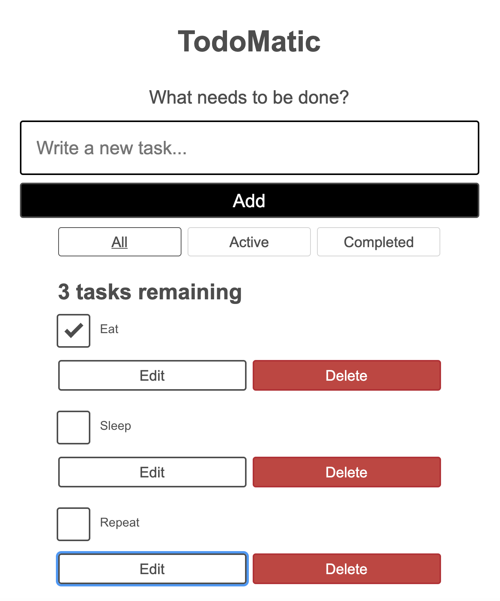

# React Blog

> A To-Do List App built in React, to learn React fundamentals. This app allows users to add, edit, and delete tasks they want to work on, and also mark tasks as complete without deleting them.

## Table of contents

- [General info](#general-info)
- [Screenshots](#screenshots)
- [Technologies](#technologies)
- [Setup](#setup)
- [Features](#features)
- [Status](#status)
- [Inspiration](#inspiration)
- [Contact](#contact)

## General info

In this project I learnt how to setup a React app using the command-line interface (CLI) tool create-react-app. I also learnt about JSX, props, components, events, useState hook and accessibility in React.

## Screenshots

Below is what you should see when you run the project.

## Technologies

- HTML5
- CSS3
- JavaScript
- React - 17.0.2

## Setup

### Install dependencies

### `npm install`

In the project directory, you can run:

### `npm start`

Runs the app in the development mode.\
Open [http://localhost:3000](http://localhost:3000) to view it in the browser.

The page will reload if you make edits.\
You will also see any lint errors in the console.

### `npm test`

Launches the test runner in the interactive watch mode.\
See the section about [running tests](https://facebook.github.io/create-react-app/docs/running-tests) for more information.

## Features

List of features ready

- Read a list of tasks.
- Add a task using the mouse or keyboard.
- Mark any tak as completed, using the mouse or keyboard.
- Delete any task, using the mouse or keyboard.
- Edit any task, using the mouse or keyboard.
- View a specific subset of tasks: All tasks, only the active task, or only the completed tasks.

## Status

Project is: _in progress_ I am hoping to add new features to this project in the future.

## Inspiration

Code along using MDN web Docs [MDN React todo list Project](https://developer.mozilla.org/en-US/docs/Learn/Tools_and_testing/Client-side_JavaScript_frameworks/React_getting_started)

## Contact

Created by [@Max88-git](mlockwood@hotmail.co.uk/) - feel free to contact me!
